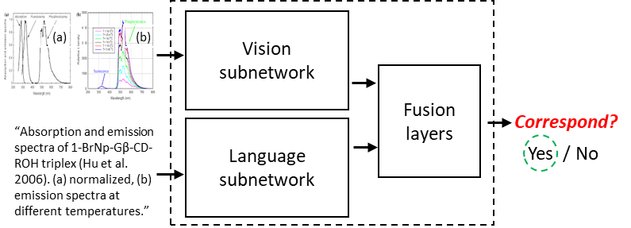

# Look, Read and Enrich

## Materials to reproduce the experiments and results in: Look, Read and Enrich - Learning from Scientific Figures and their Captions.

Automatically interpreting scientific figures is particularly hard compared to natural images. However, there is a valuable source of information in scientific literature that until now has remained untapped: the correspondence between a figure and its caption. Here we 
introduce a Figure-Caption Correspondence learning task that results from investigating what can be learnt by looking at a large number of figures and reading their captions and provide the necessary code and data to reproduce the experiments related to such task.



FCC trains visual and language networks without additional supervision other than pairs of unconstrained figures and captions. We also support transferring lexical and semantic knowledge from existing knowledge graphs, which has proved to significantly improve the resulting features. 

This repository also provides code and data to leverage the FCC visual and language features in transfer learning tasks involving scientific text and figures, namely classification and multi-modal machine comprehension. Upon execution, our experiments show improvement or results on par with supervised baselines and ad-hoc approaches.

## Dependencies:
To use this code you will need:

* Python 3.7
* Keras 2.2.4
* Scikit-learn 0.20.1
* Numpy 1.16.1
* Pillow 5.4.1
* Tqdm 4.28.1

## How to run the experiments:

**1. Execute the script download.py with the materials you want to download:**

```
python download.py
```

**2. Use the different python scripts to execute the experiments.**

**Figure-Caption Correspondance Experiments**: We execute a correspondance and a bidirectional retrieval experiments between the scientific figures and their captions as they appear together in a scientific publication. The corpora used in this experiment can be Scigraph or Semantic Scholar. Also, it is possible to use Coco and Flickr30k in this experiments. To do so, download their images and resize them to 224x22 in directories:"look_read_and_enrich/images/coco/" and "look_read_and_enrich/images/flickr30k/".

```
cross_experiments.py [-h] -c CORPUS [-t]

optional arguments:
  -h, --help                    show this help message and exit
  -t, --trainable               Trainable Vision Model

required arguments:
  -c CORPUS, --corpus CORPUS    Selected Corpus: flickr30k, coco, scigraph or semscholar
```

**Categorization Experiments**: We categorize the figures and captions in five different categories. To do so, we use the weights generated in the CrossModal experiment for the captions and with the introduction of KG (Vecsigrafo) for the figures.

```
cat_experiments.py [-h] [-w WEIGHTS] [-t]

optional arguments:
  -h, --help                      show this help message and exit
  -w WEIGHTS, --weights WEIGHTS   Weights: FCC6 or FCC7
  -t, --trainable                 Trainable Model
```

**TQA Experiments**: We reproduce the baseline for the TQA challenge, as we replace the VGG-19 with the visual network of the LVC (Language-Visual Correspondance) model to extract the features of the figures within the context and questions.

```
tqa_experiments.py [-h] -q QUESTIONTYPE -m MODELTYPE

optional arguments:
  -h, --help                                      show this help message and exit

required arguments:
  -q QUESTIONTYPE, --questionType QUESTIONTYPE    Question Type: nonDiagramQuestions or diagramQuestions
  -m MODELTYPE, --modelType MODELTYPE             Model Type: Text, Diagram, Cross or CrossVecsi
```

## Requirements:
~19GB free space disk
