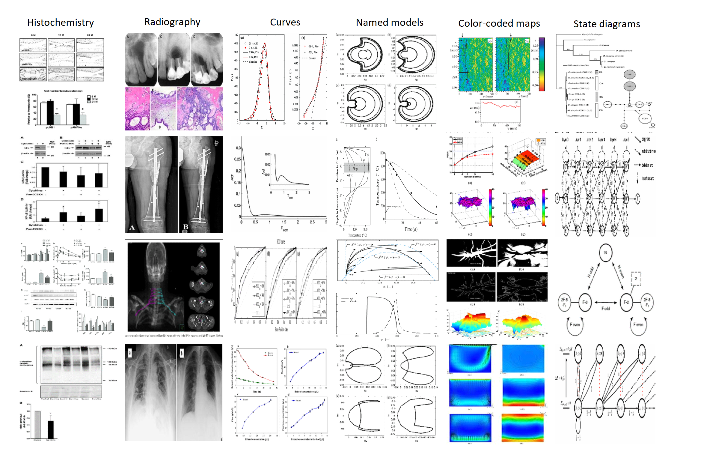
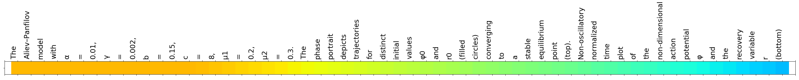
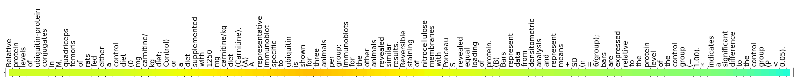

# Look, Read and Enrich

## Materials to reproduce the experiments and results in **[Look, Read and Enrich - Learning from Scientific Figures and their Captions.](https://arxiv.org/abs/1909.09070)**

Automatically interpreting scientific figures is particularly hard compared to natural images. However, there is a valuable source of information in scientific literature that until now has remained untapped: the correspondence between a figure and its caption. In the associated paper we present a Figure-Caption Correspondence (FCC) learning task that results from investigating what can be learnt by looking at a large number of figures and reading their captions. In this repository we provide the necessary code and data to reproduce the experiments related to such task that are presented in the paper.


FCC trains visual and language networks without additional supervision other than pairs of unconstrained figures and captions. We also support transferring lexical and semantic knowledge from existing knowledge graphs, which has proved to significantly improve the resulting features. 

This repository also provides code and data to leverage the FCC visual and language features in transfer learning tasks involving scientific text and figures for multi-modal classification of scientific figures and text over a taxonomy and multi-modal machine comprehension for question answering. 

## Dependencies:
To use this code you will need:

* Python 3.6.3
* Keras 2.2.4
* Scikit-learn 0.20.1
* Numpy 1.16.1
* Pillow 5.4.1
* Tqdm 4.28.1
* ~25GB free space disk

## How to run the experiments:

**1. Execute the script download.py to download from [Zenodo](https://zenodo.org/record/3258126) the materials (corpora and weights):**

```
python download.py
```

**2. Use the different python scripts to execute the experiments.**

**Figure-Caption Correspondance Experiments**: We execute correspondence and bidirectional retrieval experiments between the scientific figures and their captions. The corpora used are Scigraph or Semantic Scholar. Also, for the bidirectional retrieval task we support [Coco](http://cocodataset.org/#download)(2014)  and [Flickr30k](http://shannon.cs.illinois.edu/DenotationGraph/). To use Flickr30k/Coco, download the images from their repositories, resize them to 224x224 resolution, and leave the resulting images in folders "look_read_and_enrich/images/coco/" and "look_read_and_enrich/images/flickr30k/".

```
fcc.py [-h] -c CORPUS [-t]

optional arguments:
  -h, --help                    show this help message and exit
  -t, --trainable               Trainable Vision Model

required arguments:
  -c CORPUS, --corpus CORPUS    Selected Corpus: flickr30k, coco, scigraph or semscholar
```

**Multimodal Classification Experiments**: We categorize the figures and captions over the SciGraph categories. To do so, we use the visual features generated in the FCC experiment (FCC6: plain FCC trained on SemScholar, FCC7: includes semantic embeddings from Vecsigrafo).

```
multimodal_classification.py [-h] [-w WEIGHTS] [-t]

optional arguments:
  -h, --help                      show this help message and exit
  -w WEIGHTS, --weights WEIGHTS   Weights: FCC6 or FCC7
  -t, --trainable                 Trainable Model
```

**TQA Experiments**: We reproduce the baselines for the TQA challenge and extend it with the FCC visual features and pre-trained semantic embeddings from Vecsigrafo. Question types include multiple choice non-diagram questions and multiple choice diagram questions. Model types include text only, diagram only, Cross (using the visual FCC features) and CrossVecsi (adding Vecsigrafo to represent the TQA words).

```
tqa.py [-h] -q QUESTIONTYPE -m MODELTYPE

optional arguments:
  -h, --help                                      show this help message and exit

required arguments:
  -q QUESTIONTYPE, --questionType QUESTIONTYPE    Question Type: nonDiagramQuestions or diagramQuestions
  -m MODELTYPE, --modelType MODELTYPE             Model Type: Text, Diagram, Cross or CrossVecsi
```

## Qualitative analysis of the FCC task - Selected features and heatmaps
The individual figures selected for the analysis in the paper can be found in  the folder **qualitative_analysis** folder.

**Selected visual features**. We pick the features with the most significant activation over the dataset and select the figures that
activate them most. The figure shows a selection of 6 visual features with the 4 figures that activate each feature more significantly. The top row labels the dominant pattern for each feature. 


**Visual features (heatmaps)**. The figure below shows the activation heatmaps corresponding to the features and figures above.


**Text features**. Similar to the visual case, we select the features from the last block of the language subnetwork with the most significant activation. For visualization purposes, we show the figures corresponding to the captions that most activate such
features.



**Text features (heatmaps)**
Sample caption activation heatmaps. Red is high activation, blue is low.

"The Aliev-Panfilov model with  α = 0.01, ɣ = 0.002, b = 0.15, c = 8, μ1 = 0.2, μ2 = 0.3. The phase portrait depicts trajectories for distinct initial values φ0 and r0 (filled circles) converging to a stable equilibrium point (top). Non-oscillatory normalized time plot of the non-dimensional action potential φ and the recovery variable r (bottom)."


"Relative protein levels of ubiquitin-protein conjugates in M. quadriceps femoris of rats fed either a control diet (0 mg carnitine/ kg diet; Control) or a diet supplemented with 1250 mg carnitine/kg diet (Carnitine). (A) A representative immunoblot specific to ubiquitin is shown for three animals per group; immunoblots for the other animals revealed similar results. Reversible staining of nitrocellulose membranes with Ponceau S revealed equal loading of protein. (B) Bars represent data from densitometric analysis and represent means ±SD (n = 6/group); bars are expressed relative to the protein level of the control group (= 1.00). * indicates a significant difference to the control group (P < 0.05)."


## How to cite

**_Jose Manuel Gomez-Perez and Raul Ortega. 2019. Look, Read and Enrich. Learning from Scientific Figures and their Captions. In Proceedings of the 10th international conference on Knowledge capture (K-CAP ’19), Mayank Kejriwal and Pedro Szekely (Eds.). ACM, New York, NY, USA. DOI: https://doi.org/10.1145/3360901.3364420_**   

@inproceedings{LookReadEnrich19,  
 author = {Gomez-Perez, Jose Manuel and Ortega, Raul},  
 title = {Look, Read and Enrich. Learning from Scientific Figures and their Captions},  
 booktitle = {Proceedings of the 10th International Conference on Knowledge Capture},  
 series = {K-CAP '19},  
 year = {2019},  
 isbn = {978-1-4503-7008-0/19/11},  
 location = {Marina del Rey, CA, USA},  
 pages = {},  
 numpages = {8},  
 url = {},  
 doi = {https://doi.org/10.1145/3360901.3364420},  
 acmid = {},  
 publisher = {ACM},  
 address = {New York, NY, USA},  
 keywords = {scientific figures, figure-caption correspondence, knowledge graphs, transfer learning, multimodal machine comprehension}}  
